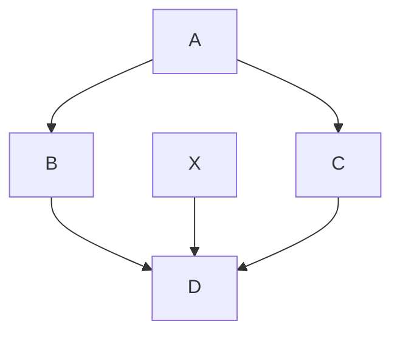
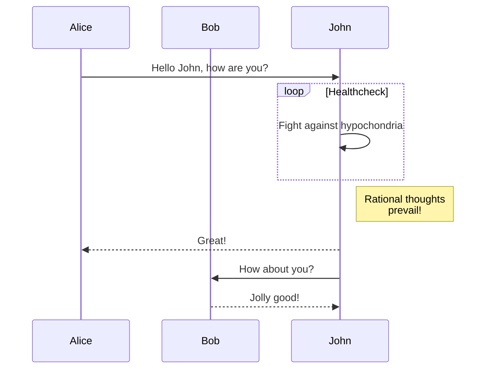
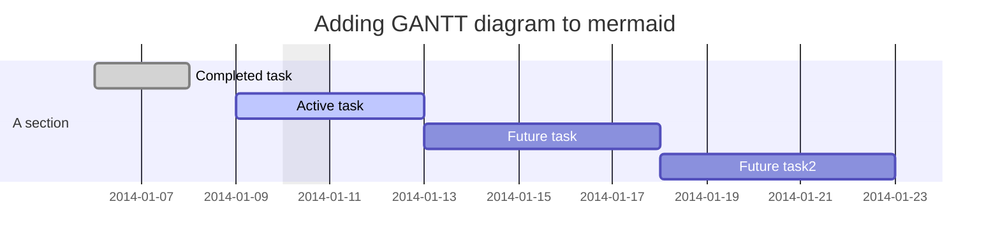
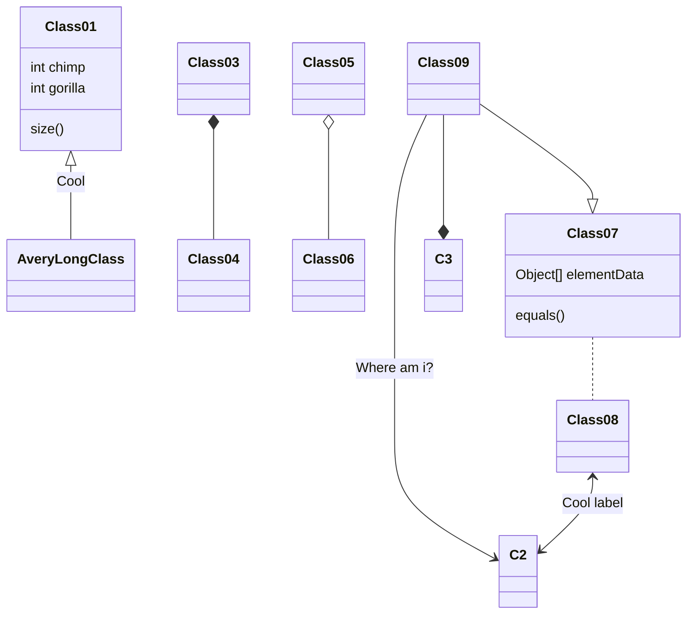
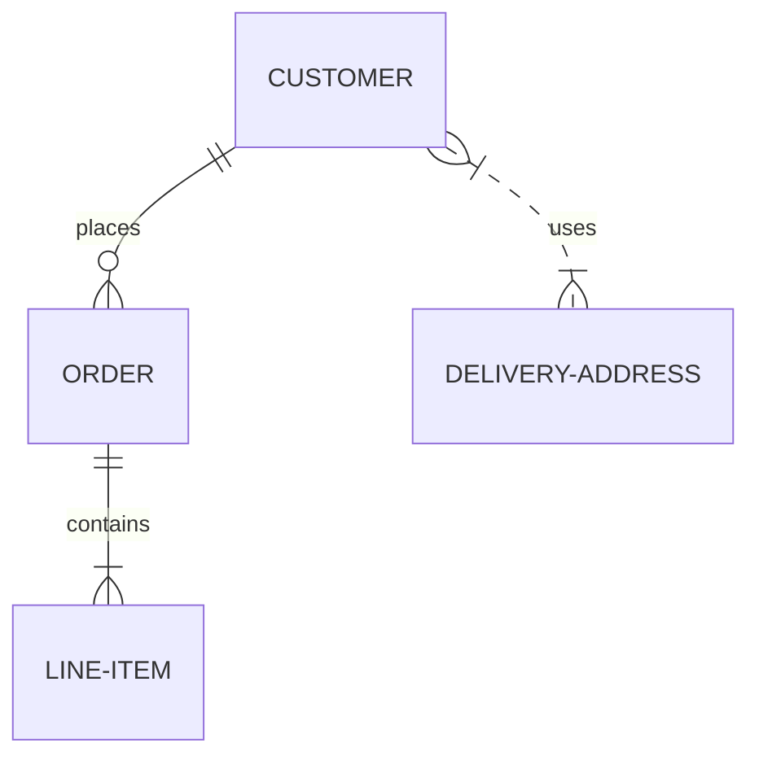
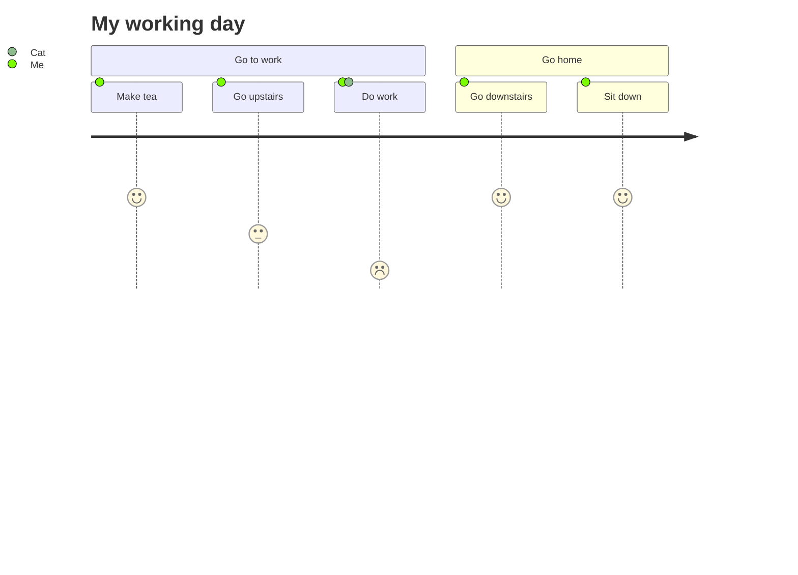

# IntellijTmp01

## Temporary mermaid tests (FIXME: remove it)

### graph TD

### sequenceDiagram

### gantt

### classDiagram

### gitGraph

### erDiagram

### journey

## Template ToDo list
- [x] Create a new [IntelliJ Platform Plugin Template][template] project.
- [ ] Verify the [pluginGroup](/gradle.properties), [plugin ID](/src/main/resources/META-INF/plugin.xml) and [sources package](/src/main/kotlin).
- [ ] Review the [Legal Agreements](https://plugins.jetbrains.com/docs/marketplace/legal-agreements.html).
- [ ] [Publish a plugin manually](https://www.jetbrains.org/intellij/sdk/docs/basics/getting_started/publishing_plugin.html) for the first time.
- [ ] Set the Plugin ID in the above README badges.
- [ ] Set the [Deployment Token](https://plugins.jetbrains.com/docs/marketplace/plugin-upload.html).
- [ ] Click the <kbd>Watch</kbd> button on the top of the [IntelliJ Platform Plugin Template][template] to be notified about releases containing new features and fixes.

<!-- Plugin description -->
This Fancy IntelliJ Platform Plugin is going to be your implementation of the brilliant ideas that you have.

This specific section is a source for the [plugin.xml](/src/main/resources/META-INF/plugin.xml) file which will be
extracted by the [Gradle](/build.gradle.kts) during the build process.

To keep everything working, do not remove `<!-- ... -->` sections. 
<!-- Plugin description end -->

## Installation

- Using IDE built-in plugin system:
  
  <kbd>Preferences</kbd> > <kbd>Plugins</kbd> > <kbd>Marketplace</kbd> > <kbd>Search for "IntellijTmp01"</kbd> >
  <kbd>Install Plugin</kbd>
  
- Manually:

  Download the [latest release](https://github.com/langara/IntellijTmp01/releases/latest) and install it manually using
  <kbd>Preferences</kbd> > <kbd>Plugins</kbd> > <kbd>⚙️</kbd> > <kbd>Install plugin from disk...</kbd>

---
Plugin based on the [IntelliJ Platform Plugin Template][template].

[template]: https://github.com/JetBrains/intellij-platform-plugin-template
